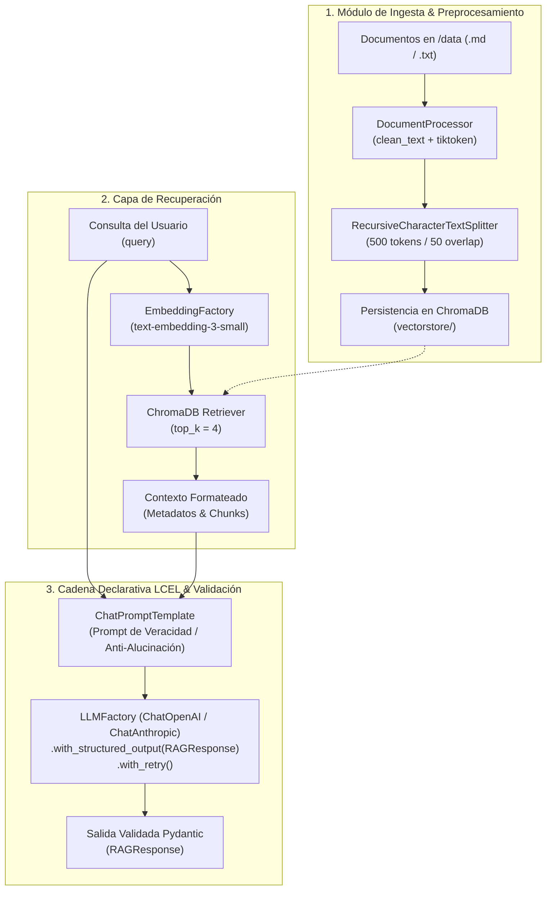

# Pre-entrega 3: Sistema de Recuperación Semántica Local (RAG)

Este repositorio contiene la solución completa a la **Pre-entrega 3: Sistema de Recuperación Semántica Local (RAG)**, implementando una arquitectura modular y asíncrona con **LangChain Expression Language (LCEL)**, base de datos vectorial local con **ChromaDB**, tokenización estratégica con **tiktoken**, y validación tipada estricta mediante **Pydantic**.

---

## 📌 Qué Construye este Proyecto

Un flujo **End-to-End de RAG (Retrieval-Augmented Generation)** capaz de:
1. **Ingestar y Preprocesar Documentos**: Limpieza de texto y división (*chunking*) estratégica por tokens (>=500 tokens con 50 de solapamiento) de archivos técnicos en `/data`.
2. **Gestionar Almacenamiento Vectorial Persistente**: Indexación con **ChromaDB** local (`./vectorstore`), verificando si la base ya existe para evitar reindexaciones innecesarias y asegurar coherencia de embeddings.
3. **Recuperación Semántica de Alta Precisión**: Búsqueda por similitud vectorial configurada con `top_k=4` para evitar degradación de contexto (*Lost in the Middle* / Contexto Infinito).
4. **Cadena Declarativa Asíncrona (LCEL)**: Orquestación mediante operador pipe `|`, invocación con `.ainvoke()` y prompt estricto de veracidad (filtro anti-alucinación).
5. **Salida Estructurada Pydantic**: Parseo y validación de la respuesta retornando un modelo tipado que incluye texto de respuesta, booleano de presencia en contexto (`encontrado_en_contexto`), lista de citas/fuentes (`referencias`) y nivel de confianza.

---

## 📁 Estructura del Repositorio

```text
preentrega/
├── .env.example              # Plantilla de variables de entorno (API keys, configuración)
├── .gitignore                # Reglas de exclusión (ignora .env, vectorstore, __pycache__)
├── pytest.ini                # Configuración de Pytest (asyncio_mode, markers, testpaths)
├── README.md                 # Documentación técnica y guía de ejecución
├── requirements.txt          # Dependencias de Python necesarias (incluye pytest, pytest-asyncio)
├── models.py                 # Enums de proveedores (Provider, EmbeddingProvider, NivelConfianza)
├── schemas.py                # Modelos Pydantic de salida estructurada (RAGResponse, ReferenciaDocumento)
├── config.py                 # Configuración centralizada y validada con Pydantic BaseSettings
├── factory.py                # Factoría desacoplada de ChatModels y Embeddings (OpenAI / Anthropic)
├── document_processor.py     # Limpieza regex, conteo por tokens con tiktoken y RecursiveCharacterTextSplitter
├── ingestion.py              # Carga de archivos /data, verificación de persistencia y upsert en ChromaDB
├── chain.py                  # Cadena LCEL RAG asíncrona, prompt de veracidad y get_rag_response()
├── main.py                   # Script demostrativo de ejecución interactiva de casos de prueba
├── tests/                    # Suite de pruebas automatizadas con Pytest
│   ├── __init__.py           # Inicialización del paquete de tests
│   ├── conftest.py           # Fixtures reutilizables (configuración, mocks, respuestas esperadas)
│   └── test_rag.py           # Pruebas unitarias, asíncronas LCEL e integración
└── data/                     # Dataset de documentos técnicos (.md)
    ├── 01_arquitectura_microservicios.md
    ├── 02_politica_resiliencia_reintentos.md
    ├── 03_protocolo_gestion_incidentes.md
    └── 04_seguridad_gestion_secretos.md
```

---

## 🏗️ Arquitectura del Sistema



---

## 🛡️ Filtro de Veracidad y Anti-Alucinación

El prompt de sistema instruye al modelo a comportarse como un analista técnico estricto que responde **únicamente** con los fragmentos suministrados. Si una consulta no puede responderse con el contexto:
- Asigna `encontrado_en_contexto = False`.
- Declara textualmente: *"No lo sé. La información solicitada no se encuentra en el contexto documental provisto."*
- Asigna `nivel_de_confianza = "no_encontrado"`.
- Devuelve una lista de `referencias` vacía (`[]`).

---

## ⚙️ Instalación y Configuración

### 1. Crear Entorno Virtual e Instalar Dependencias

```bash
# Crear entorno virtual
python -m venv .venv

# Activar en Windows (PowerShell)
.venv\Scripts\Activate.ps1

# Activar en Linux/macOS
source .venv/bin/activate

# Instalar dependencias
pip install -r requirements.txt
```

### 2. Configurar Variables de Entorno

Copia el archivo `.env.example` a `.env` y coloca tu clave de API:

```bash
cp .env.example .env
```

Edita `.env` con tus credenciales:

```ini
PROVIDER=openai
MODEL=gpt-4o-mini
OPENAI_API_KEY=sk-...

CHROMA_PERSIST_DIR=./vectorstore
COLLECTION_NAME=rag_knowledge_base
EMBEDDING_PROVIDER=openai
EMBEDDING_MODEL=text-embedding-3-small

DATA_DIR=./data
CHUNK_SIZE=500
CHUNK_OVERLAP=50
TOP_K=4
```

---

## 🚀 Ejecución

### Opción A: Ejecutar el Script Principal de Pruebas

Ejecuta el flujo completo (ingesta si no existe + casos de prueba):

```bash
python main.py
```

### Opción B: Ejecutar la Ingesta de forma Independiente

Si deseas indexar o forzar la reconstrucción de la base vectorial:

```bash
python ingestion.py
```

---

## 🧪 Suite de Pruebas Automatizadas con Pytest

El proyecto cuenta con una suite formal de **24 pruebas automatizadas** en `tests/test_rag.py` configurada con `pytest` y `pytest-asyncio` para garantizar reproducibilidad y validación continua sin depender de ejecuciones manuales:

### 1. Ejecutar Todas las Pruebas

```bash
pytest -v
```

### 2. Ejecutar Pruebas por Categoría (Markers)

```bash
# Solo pruebas unitarias deterministas (desacopladas, sin consumo de API):
pytest -m unit -v

# Solo pruebas de integración en vivo (requiere API key en .env):
pytest -m integration -v
```

### 3. Cobertura de la Suite de Pruebas

| Módulo de Pruebas | Clase de Test | Qué Valida |
|---|---|---|
| **Preprocesador y Tokenizer** | `TestDocumentProcessor` | Limpieza regex de caracteres de control, conteo exacto de tokens con `tiktoken`, chunking (`>=500` tokens) y generación de metadatos (`chunk_id`, `source`, `tokens`). |
| **Esquemas Pydantic** | `TestSchemas` | Validación estricta de `RAGResponse`, `ReferenciaDocumento` y consistencia de tipos (`NivelConfianza`). |
| **Configuración del Sistema** | `TestRAGConfig` | Restricciones de negocio en `RAGConfig` (límites de `top_k`, `chunk_size >= 100`, `chunk_overlap < chunk_size`, `timeout > 0`). |
| **Formateo y Prompts** | `TestContextAndPromptFormatting` | Formateo trazable de citas (`[FUENTE: ... \| CHUNK ID: ...]`) y estructura de directivas anti-alucinación en el prompt. |
| **Factorías Desacopladas** | `TestFactories` | Validación de instanciación y control de errores por credenciales faltantes. |
| **Cadena Asíncrona LCEL** | `TestRAGChainAsync` | Invocación `.ainvoke()`, validación de respuestas Grounded con citas, activación del filtro Anti-Alucinación ("No lo sé"), y mecanismo de reintentos con realimentación. |
| **Integración en Vivo** | `TestLiveIntegration` | Validación end-to-end con ChromaDB y modelo LLM real (omitida si no hay API key configurada). |

---

## 🧪 Casos de Prueba Incluidos

El script `main.py` ejecuta automáticamente 4 casos representativos:

| # | Caso | Pregunta | Esperado en Contexto | Validación Anti-Alucinación |
|---|---|---|:---:|:---:|
| **1** | **Grounded** | *"¿Cuáles son los 3 estados del Circuit Breaker y qué política de reintentos con backoff exponencial se debe aplicar?"* | **SÍ** (`True`) | Cita `02_politica_resiliencia_reintentos.md` |
| **2** | **Grounded** | *"¿Cuál es el tiempo objetivo de respuesta para un incidente SEV-1 y quién debe liderar el postmortem blameless?"* | **SÍ** (`True`) | Cita `03_protocolo_gestion_incidentes.md` |
| **3** | **Trampa (General)** | *"¿Cuál es la receta tradicional para preparar una auténtica salsa pomodoro italiana con albahaca?"* | **NO** (`False`) | Responde "No lo sé" y `encontrado_en_contexto=False` |
| **4** | **Trampa (Técnica)** | *"¿Cómo se configura el driver cuántico Q-Kube v4.9 con aceleradores taquiónicos en el clúster de Kubernetes?"* | **NO** (`False`) | No alucina; declara ausencia de datos en contexto |

---

## 📋 Ejemplo de Salida Pydantic Validada (JSON)

### Caso Grounded (Información Encontrada):
```json
{
  "respuesta": "Los tres estados del Circuit Breaker son: Cerrado (Closed), Abierto (Open) y Semi-Abierto (Half-Open). En el estado Cerrado las solicitudes fluyen con normalidad; si la tasa de fallas supera el 50% en una ventana de 20 solicitudes, pasa a Abierto durante 30 segundos (Fast-Fail). Luego pasa a Semi-Abierto permitiendo hasta 5 solicitudes de prueba.\nPara los reintentos, solo se permiten en operaciones idempotentes (o con header X-Idempotency-Key), hasta un máximo de 3 reintentos adicionales, aplicando backoff exponencial con Full Jitter (base 100ms, máximo 3000ms).",
  "encontrado_en_contexto": true,
  "referencias": [
    {
      "fuente": "02_politica_resiliencia_reintentos.md",
      "chunk_id": "02_politica_resiliencia_reintentos.md_chunk_1",
      "fragmento_clave": "El Circuit Breaker previene que un servicio siga realizando llamadas remotas a una dependencia que está degradada o inactiva. Funciona como una máquina de estados finita con tres estados: Estado Cerrado (Closed)... Estado Abierto (Open)... Estado Semi-Abierto (Half-Open)."
    }
  ],
  "nivel_de_confianza": "alta"
}
```

### Caso Trampa (Filtro Anti-Alucinación):
```json
{
  "respuesta": "No lo sé. La información solicitada no se encuentra en el contexto documental provisto.",
  "encontrado_en_contexto": false,
  "referencias": [],
  "nivel_de_confianza": "no_encontrado"
}
```

---

## 🧩 Errores Comunes Mitigados

- **Contexto Infinito Evitado**: Búsqueda restringida a `top_k=4` manteniendo el consumo de tokens bajo control y eliminando el fenómeno *Lost in the Middle*.
- **Embeddings Coincidentes**: Factoría unificada (`EmbeddingFactory`) para indexación y recuperación con el mismo modelo.
- **Optimización de Persistencia**: Verificación en `ingestion.py` de colecciones existentes en ChromaDB antes de indexar, optimizando costos y tiempos de ejecución.
